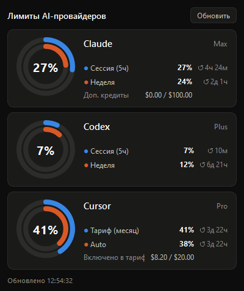

# AIBar — дашборд лимитов AI-провайдеров для Windows

Аналог [CodexBar-KDE](https://github.com/EvilFreelancer/CodexBar-KDE) для Windows:
иконка в системном трее с радиальным индикатором квот + всплывающий дашборд
с карточками провайдеров.

Репозиторий: **https://github.com/SLem233/AIBar** · готовый exe —
в [Releases](https://github.com/SLem233/AIBar/releases).



## Что показывает

- **Иконка в трее** — два кольца: сессия (синее, внешнее) и неделя (оранжевое,
  внутреннее) самого загруженного провайдера, в центре — процент сессии.
- **Дашборд** (клик по иконке) — карточка на провайдера: радиальный индикатор,
  тариф, все окна лимитов с процентами и обратным отсчётом до сброса,
  дополнительные кредиты.
- **Виджет на рабочем столе** (включён по умолчанию) — полупрозрачная
  колонка круговых индикаторов по провайдерам, висит поверх всех окон:
  - перетаскивается мышью за любое место;
  - **авто-ориентация** — во время перетаскивания, как только рамка виджета
    касается левого/правого края экрана, виджет встаёт вертикально (кружки
    в столбик), при касании верхнего/нижнего края — поворачивается
    горизонтально (кружки в ряд). Сама рамка виджета при этом переворачивается
    (меняет ширину и высоту местами вокруг центра), а кольца сохраняют размер
    — меняется только их расположение. Виджет нельзя утащить за пределы
    экрана: при касании края он тут же прилипает к нему;
  - размер меняется за уголок справа внизу (позиция и размер запоминаются);
  - **левый клик** по виджету открывает полный дашборд рядом с ним
    (как клик по иконке в трее); наведение мыши больше ничего не открывает;
  - правый клик — меню (обновить / мини-режим / скрыть при простое /
    проверить обновления / настройки / справка / скрыть / выход),
    включается и выключается из меню трея («Виджет поверх окон»);
  - **скрывать виджет при простое** (пункт меню, доступен только когда
    «Виджет поверх окон» включён) — сразу, как только курсор уходит с виджета,
    он **плавно уезжает** за ближайший край экрана (~1 секунда анимации),
    оставляя снаружи ~15% своей рамки как «закладку». Стоит навести курсор на
    эту закладку — виджет плавно выплывает обратно и пристыковывается к краю
    экрана. Виджет при этом не меняет размер и цвет — только уезжает за
    границу экрана. Пока курсор на виджете, он не прячется;
  - **масштаб** — пункт «Масштаб» в контекстном меню виджета (ползунок) и в
    меню иконки в трее (дискретные значения) регулирует размер виджета и
    панели в диапазоне **75–150%** (по умолчанию 100%);
  - под названием каждого провайдера на виджете показывается **время до
    сброса ближайшего окна** лимита: `1ч 22м` для коротких (5-часовых) окон,
    `2д 5ч` для длинных (недельных, как у Codex);
  - **мини-режим** — на виджете остаются только провайдеры, у которых
    какой-либо лимит израсходован на 70%+ (`mini_threshold` в конфиге).
    Если таких нет — показывается один: тот, чьи лимиты активнее всего
    росли за последние 15 минут, а при полном затишье — показанный
    последним. Дашборд (из трея и по клику на виджет) всегда показывает всех.
- **Справка** — пункт «Справка» в меню виджета и трея открывает встроенную
  HTML-инструкцию (`aibar/resources/help.html`) в браузере.
- **Проверка обновлений** — приложение сверяет свою версию с последним
  релизом на GitHub. Автоматически — раз в час: если вышла новая, на
  виджете появляется плашка «↓ Update available». Вручную — пункт
  «Проверить обновления…» в меню трея или виджета: найдя новый релиз,
  AIBar скачивает `AIBar.exe` в папку **«Загрузки»** (`AIBar-v<версия>.exe`,
  старые версии автоматически удаляются), а на **рабочем столе**
  создаёт/обновляет ярлык «AIBar», всегда указывающий на актуальную
  версию. По завершении скачивания предлагается перезапустить AIBar для
  применения обновления (новый запускается из Загрузок, текущий
  закрывается).
  Установленная версия показана в меню трея, контекстном меню виджета,
  tooltip иконки и в подписи внизу дашборда.
- **Работа без VPN** — Claude, Codex и OpenAI API из некоторых сетей
  недоступны (гео-блок, HTTP 403). Перед каждым циклом опроса приложение
  делает один анонимный запрос (без токенов); если он получает 403,
  запросы с токенами к этим трём провайдерам не отправляются вовсе:
  на виджете появляется плашка «⏸ нет VPN», у тайлов — значок ⏸,
  а кольца держат последние полученные значения. Остальные провайдеры
  продолжают обновляться. Как только VPN появляется, опрос оживает сам
  на ближайшем цикле. Детекция каскадная (api.anthropic.com →
  api.openai.com → chatgpt.com): rate-limit (429) и сетевые ошибки не
  считаются блокировкой, при полном отсутствии сети показывается честная
  «Сетевая ошибка», а не «нет VPN».

## Провайдеры

| Провайдер | Источник авторизации | API |
|-----------|----------------------|-----|
| Claude (Claude Code) | `~/.claude/.credentials.json` | `api.anthropic.com/api/oauth/usage` |
| Codex (ChatGPT) | `~/.codex/auth.json` | `chatgpt.com/backend-api/wham/usage` |
| Cursor | `%APPDATA%\Cursor\...\state.vscdb` | `cursor.com/api/usage-summary` |
| Z.ai / zcode | API-ключ в настройках или `Z_AI_API_KEY` | `api.z.ai/api/monitor/usage/quota/limit` |
| OpenCode | cookie `auth` с opencode.ai (в настройках) | `opencode.ai/_server` (RPC) |
| Google (Gemini) | вход в `gemini` CLI (`~/.gemini`) | `cloudcode-pa.googleapis.com` (квоты моделей) |
| OpenAI API | Admin-ключ (в настройках) | `api.openai.com/v1/organization/costs` |
| Tavily | API-ключ `tvly-…` или `TAVILY_API_KEY` | `api.tavily.com/usage` |

Провайдеры включаются в **Настройках** (меню трея или правый клик по виджету).
Claude, Codex и Cursor работают без ключей — приложение только читает токены,
которые поддерживают сами приложения (`claude`, `codex`, Cursor). Если токен
истёк, достаточно запустить соответствующий CLI/приложение.

Для **Z.ai (zcode)** нужен API-ключ coding-плана: z.ai → Manage API Key →
Coding Plan (или bigmodel.cn для китайского региона — переключатель в
настройках). Для **OpenCode** — cookie `auth` со страницы opencode.ai
(DevTools → Application → Cookies), workspace `wrk_…` определяется
автоматически.

**OpenAI API** показывает расход за текущий месяц через Costs API — нужен
именно **Admin-ключ** (platform.openai.com → Settings → Organization →
Admin keys), обычный ключ проекта получает 401. Баланс предоплаченных
кредитов OpenAI по API не отдаёт, поэтому остаток считается от «якоря»:
введите в настройках остаток со страницы биллинга и дату — дальше приложение
само вычитает из него расходы Costs API. Бюджет $/мес даёт кольцо
«потрачено % от бюджета».

**Google (Gemini)** — квоты моделей (Pro/Flash) через OAuth Gemini CLI;
нужен один раз выполненный вход в `gemini`. Баланс и траты AI Studio API
Google программно не отдаёт (только дашборд AI Studio). **Tavily** — обычный
ключ, квота кредитов плана. **Serper.dev** не поддержан: у него нет API для
баланса.

## Установка и запуск

Готовый exe: `dist\AIBar.exe` — запускается двойным кликом, ничего
устанавливать не нужно.

Из исходников:

```powershell
pip install -r requirements.txt
# запуск без консоли
.\AIBar.bat
# или с консолью (для отладки)
python -m aibar.main
```

Пересборка exe:

```powershell
pip install pyinstaller
pyinstaller --noconfirm --clean --onefile --windowed --name AIBar --icon assets\aibar.ico --add-data "aibar/resources;aibar/resources" run_aibar.py
```

### Автозапуск

Скопировать ярлык на `dist\AIBar.exe` (или `AIBar.bat` при запуске из
исходников) в папку автозагрузки: `Win+R` → `shell:startup`.

## Настройки

`%APPDATA%\AIBar\config.json`:

```json
{
  "refresh_seconds": 300,
  "providers": ["Claude", "Codex", "Cursor"],
  "widget_enabled": true,
  "widget_hide_on_idle": false,
  "widget_scale": 1.0,
  "widget_geometry": [1650, 60, 120, 260],
  "widget_mode": "full",
  "mini_threshold": 70,
  "zai_api_key": "",
  "zai_region": "global",
  "opencode_cookie": "",
  "opencode_workspace": "",
  "openai_admin_key": "",
  "openai_budget_usd": 0,
  "openai_balance_usd": 0,
  "openai_balance_date": "",
  "tavily_api_key": "",
  "claude_renewal_date": "08.08.2026",
  "claude_renewal_period": "month",
  "cursor_renewal_date": "",
  "cursor_renewal_period": "year",
  "zai_renewal_date": "",
  "zai_renewal_period": "year",
  "tavily_renewal_date": "",
  "tavily_renewal_period": "month"
}
```

`*_renewal_date` / `*_renewal_period` — дата ближайшего продления и период
подписки (`month` / `quarter` / `year`) для провайдеров, чьи API не отдают
дату списания; прошедшая дата автоматически сдвигается на период вперёд.
Пустая дата — строка «Продление» не показывается. У Codex дата берётся из
API автоматически; у Cursor API отдаёт только конец месячного расчётного
цикла (он показан как «↺ до сброса» у колец), а дата продления самой
подписки задаётся здесь.

Всё это редактируется через диалог «Настройки…» — руками файл трогать не нужно.

Интервал обновления также переключается из контекстного меню иконки в трее.

## Структура

```
aibar/
├── main.py            # трей-приложение, поллинг по таймеру
├── polling.py         # цикл опроса провайдеров (чистая логика, без Qt)
├── geoblock.py        # детекция гео-блока «нет VPN» анонимным запросом
├── config.py          # настройки в %APPDATA%\AIBar
├── update.py          # сверка версии с GitHub-релизом (плашка «↓ Update»)
├── updater.py         # скачивание релиза в «Загрузки» + ярлык на рабочем столе
├── theme.py           # тёмная палитра (валидирована по CVD/контрасту)
├── providers/
│   ├── base.py        # модель данных (RateWindow, ProviderSnapshot)
│   ├── claude.py      # Claude OAuth usage
│   ├── codex.py       # Codex (ChatGPT backend) usage
│   ├── cursor.py      # Cursor (usage-summary)
│   ├── zai.py         # Z.ai coding plan (zcode)
│   ├── opencode.py    # OpenCode (opencode.ai)
│   ├── openai_api.py  # OpenAI API (расход за месяц, Costs API)
│   └── tavily.py      # Tavily (кредиты плана)
└── ui/
    ├── gauge.py       # радиальный многокольцевой индикатор (QPainter)
    ├── dashboard.py   # всплывающее окно с карточками
    ├── settings.py    # диалог настроек
    └── widget.py      # виджет поверх окон + ховер-панель
```

## Тесты

```powershell
python -m pytest tests
```

Покрывают детекцию гео-блока, цикл опроса (пауза/восстановление, сохранение
последних данных), `http_status` провайдеров и индикацию паузы в UI
(offscreen-Qt).

## Как добавить провайдера

1. Создать `aibar/providers/<name>.py` с функцией `fetch(cfg: dict) -> ProviderSnapshot`.
2. Зарегистрировать её в `PROVIDERS` (и подсказку в `PROVIDER_HINTS`) в
   `aibar/providers/__init__.py`.
3. Включить провайдера в диалоге «Настройки…».
